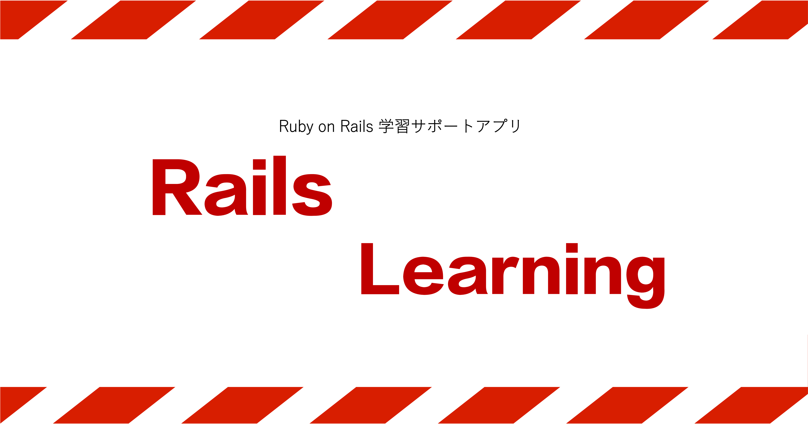

# Rails Learning

## サービスURL
https://rails-learning.com

## ◾️サービス概要

当サービスは、  
「MVCくらいなら何とかわかります、、、」というRails初学者を、  
「Railsなら基本的なことはわかりますよ！」という状態まで持っていく、  
Rails初学者が「理解・記憶・実践」を一貫して体験できる、オールインワン学習支援サービスです。

## ◾️このサービスへの思い・作りたい理由・目的・コンセプト

- 当方がRailsの学習を始めた際に、初学者用のテキストを探してみたが良書がなく、Railsチュートリアルなどの高価な動画教材は手が届かない値段をしていたので、Railsの学習が非常に不便だと感じた。そのため、いまからRailsを学びたいと考えている初学者向けに学習テキストと学習内容を復習するためのクイズ機能を組み合わせたアプリを作りたいと思ったから。
- アルゴリズムやプログラミングスキルの向上のためにpaizaというWEBサービスを利用していた友人が、復習をもっと効率的にやりたいと漏らしていたので、Rubyのプログラミングスキル学習を実践的に、そして効率的に行うためのサービスも当アプリの機能に追加した。
- 今後の人生においてプログラミング学習は長期的にやっていくと思うので、Rails Learningを作ることで、自分自身がRailsの復習や、Rubyのプログラミングスキルの向上のための学習を継続していくための手助けになると思ったから。

## ◾️ユーザー層について
- Railsの学習方法や全体像がわからない方
- Rails特有のコードが理解できない方
- Rails学習本がない or 読んだけど難しくて理解できない方
- Rubyのプログラミングスキルを向上させたい方
- paizaの復習を効率的に行いたい方

## ◾️サービスの利用イメージ
### Rails初学者のアプリの使い方
1. アカウントを作成して、すべての教材にアクセスできるようにする。
2. Rails用の学習テキストであるRails Booksの1章から学習を始めて内容を理解する。
3. 各章の各ページを読了したら、該当ページと対応する内容が出題されるクイズに挑戦して内容が理解・記憶できているか確認する。
4. クイズで内容を覚えたら、次のRails Booksの次のページに挑戦する。
5. クイズ結果をシェアしたい人は、シェアボタンからXでシェア！！

### Ruby & paiza学習のためのアプリの使い方
1. アカウントを作成して、すべての機能を利用可能にする。
2. paiza問題を解く。もしくは、Rubyの学習を行う。
3. PreCodeの新規作成画面で問題モードをONにして、学習を通して得た学びを復習するための問題を作成する。
4. 作成した復習用の問題を解くことで、継続的に復習を行う。
5. 学習内容が定着したら、もう一度paiza等に挑戦してみる。
6. 1~5を繰り返す。
7. Code Libraryで、他ユーザーが作成した問題や保存したコード断片（スニペット）が閲覧・利用できるので、そちらを利用してみるのもアリ！！
8. 他ユーザーの作成データで利用してみたいものがあれば、ブックマークやいいねボタンを押してみましょう！！

## ◾️サービスの差別化ポイント・推しポイント
- 通常のオンラインコードエディタサービスと違い、当アプリは「理解→定着→実践」の学習プロセスをを1つのアプリ内で完結できることが強み。
- Rails学習者はテキストを読んだ後すぐに、クイズに何度も挑戦することができ、テキスト内容の復習と記憶を即座に行える。
- プログラミングスキル学習者は、paiza等のサービスを利用後すぐに復習するための問題を作ることができ、コードを使った実践的な内容で効率的に復習ができる。
- アプリを初めて触る方に配慮しつつも、UI/UXをできる限りシンプルに作ったので、非常に使いやすくなっている。

## ◾️機能候補
**<ログインが必要な機能>**
- Rails Books：Rails用のテキスト機能。
- クイズ：Rails Booksの内容と連動した内容が出題されるクイズ機能。
- PreCode：「初期データ」と呼ばれる自分専用のコード断片（スニペット）を作成・保存できる機能。問題を作成することも可能。
- Code Library：他ユーザーが作成した初期データを「共有ライブラリ」として閲覧・利用できる機能。

**<ログインがいらない機能>**
- Code Editor：Ruby専用のオンラインコードエディタ機能。

**<管理者権限を持つユーザーが利用できる機能>**
- ユーザー管理機能：ユーザー検索、ユーザー権限付与、アカウント凍結・削除などができる。
- サブエディタ権限管理機能：Rails Booksやクイズの一部のページ限定で編集者権限を付与するときに使う機能。
- Rails Books管理機能：Rails Booksの作成・編集・削除を行う機能。
- クイズ管理機能：クイズの作成・編集・削除を行う機能。
- バージョン管理機能：Rails Booksやクイズを作成・編集・削除するたびにバージョンが更新され、必要に応じて過去のバージョンにロールバックできる機能。
- PreCode管理機能：全初期データの検索・閲覧・編集・削除ができる機能。
- タグ管理機能：タグの検索・統合ができる機能。
- メール通知機能：問い合わせがあった際や、Rails Booksやクイズの作成・編集・削除が行われた際に管理者宛にメールが自動送付される機能。

**<その他>**
- アカウント新規登録：ユーザー名とメールアドレスによる登録と外部認証による登録の２種類がある。
- ユーザーログイン：メールアドレスとパスワードによる認証と外部認証の２種類のログイン法がある。
- パスワードリセット：パスワードを忘れた方や変更したい方向けのパスワード再設定をする機能。
- 「初めての方へ」ボタン：初めてアプリを触る方向けに機能説明が書かれているボタン。
- ユーザープロフィール機能：ユーザーデータを閲覧・編集できる機能。
- シェア機能：Xにシェアできる機能。学習内容のアウトプットやクイズ結果のシェアなどに利用可能。
- URLコピー機能：初期データのURLを友人に共有するための機能。
- タグ作成 & タグ検索機能：タグを自由に作成 & タグ検索できる機能。
- ブックマーク機能：Code Libraryないの初期データをブックマークする機能。
- いいね機能：参考になったCode Libraryの投稿に「いいね」を押せる機能。
- いいね数・利用数の確認機能：自分で作成した初期データが、他ユーザーからどれだけ評価されたか可視化する機能。
- アプリの使い方：アプリの使い方が詳しく書かれたページ。
- お問い合わせ
- 利用規約 & プライバシーポリシー

## ◾️技術スタック
| カテゴリー | 使用技術 |
| ---------- | -------- |
| フロントエンド | Ruby on Rails |
| バックエンド | Ruby on Rails |
| インフラ | Render |
| DB | PostgreSQL |
